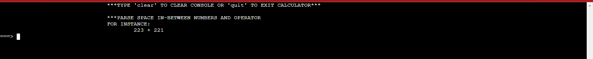

# DEMO PROJECT - CALCULATOR
The Calculator runs interactive mode, Accept only 3 Arguments (two numbers and an Operator)

## How To Use
compile calculator using this flag
``` C
gcc -Wall -pedantic -Werror -Wextra -std=gnu89 *.c -o calc
```
Then run
```C
./calc
```

